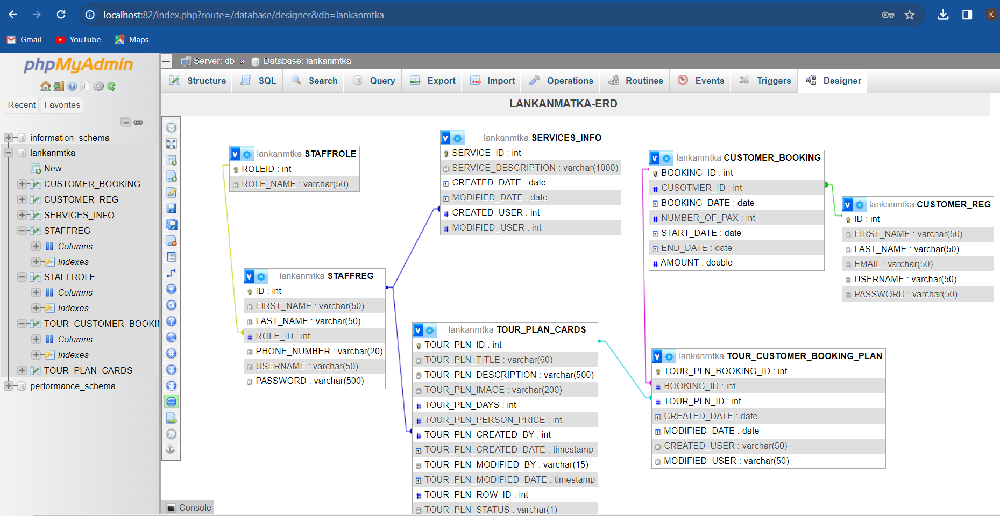

# Exercise 5: Readme.md

***Welcome to the task README!***

- You are required to create ´Readme.md´ in your project directory to document your activities throughout the project's lifecycle. 
- You will regularly update it to monitor the ongoing development of the project. 

- You will start by outlining the planned features, task assignments to team members and document the evolving progress of your work. 

- Below, you will find an example to help you get started. Feel free to customize it to match your specific requirements and needs.

# LANKAN MATKA TRAVEL BOOKING WEB PROJECT - Team 23

We have developed a travel destination management agency website. This site was developed especially to promote Sri Lanka as a travel destination among the Finnish travel enthusiasts.

## Table of Contents
- [Features](#features)
- [Database Tables](#database-tables)
- [Created Forms](#created-forms)
- [Created Tables](#created-tables)

---

## Features

In this section, list and describe the features or functionality that you are working on. You can use checkboxes to track the progress of each feature.

- [ ] Manage Tour Package (Molagoda Dissanayakage Kasun Chathuranga Dissanayaka): Tour Packge Maintenance. 
- [ ] Feature 2 (Dulshan Pramuditha Welengoda): Login Page. Services Management
- [ ] Feature 3 (Govinnage Asitha Sandaruwan): Manage User Registration 
- [ ] Feature 4 (Nawarathna Mudiyanselage Mujitha Manorathna): Package Booking Management  

> Add features as required. 

### Feature 1

As a Admin an User of the website I should be able to create/ Update/ Delete  Tour Pakages so that every visitor can see the latest tour packages in the website.

 (Include more detailed information about Feature 1 here. Provide links to related code files (github) & link to the feature (shell.hamk.fi) ).

### Feature 2

The login page will be created in order to authenticate users into the web portal after successful validation.

Management of the services for the customer will be handled by the services management page

### Feature 3

My role in Team 23 is managing user registration. In this feature I will develop user registration and create accounts on the website so they can book travel packages by registering to the site and can access other features as well offered by Lankan Matka travel agency. I make sure the registration process will be smooth and easy for users.

### Feature 4

Package booking: User package booking management, save the booking details in database, add the card to select multiple packages and finally do the payment and store all the data into the db.   

### Feature 5

Admin panel: this admin dashboard for the all the backend tasks like employee profile creation, managing, other website managing task like adding new content package, services. 

login details: 
admin
admin123
---

## Database Tables

List the database tables that are part of your project. 

- Table 1 (Created By : KASUN CHATHURANGA DISSANAYAKA): TourPlanCard 
- Table 2 (Created By): MUJITHA MANORATHNA: Staff_role 
- Table 3 (Created By): MUJITHA MANORATHNA: Customer_Booking 
- Table 4 (Created By): DULSHAN WELENGODA: SERVICES_INFO 
- Table 5 (Created By): Table Name 
- Table 6 (Created By): Table Name 

> Include the ER Diagram of the database. 

---

## Created Forms

List and describe any forms that have been created as part of your project. Include details about the purpose of each form and any validation logic.

- Form 1 (Created By KASUN CHATHURANGA DISSANAYAKA): travelPkgs.php: Link to the related code file (github) | Link to the form (shell.hamk.fi). | Validations Applied
- Form 2: (Created By): Form Name: Link to the related code file (github) | Link to the form (shell.hamk.fi).  | Validations Applied
- Form 3: (Created By): DULSHAN WELENGODA Form Name: login.php Link to the related code file (github) | Link to the form (shell.hamk.fi). | Validations Applied
- Form 4: (Created By): Form Name: Link to the related code file (github) | Link to the form (shell.hamk.fi).  | Validations Applied

---

## Created Tables

List any tables that you have created in the project work

- Table 1 (Created By KASUN CHATHURANGA DISSANAYAKA): Table Name | Link to the related code file (github) | Link to the table (shell.hamk.fi).
- Table 2 (Created By): Table Name | Link to the related code file (github) | Link to the table (shell.hamk.fi).
- Table 3 (Created By): Table Name | Link to the related code file (github) | Link to the table (shell.hamk.fi).

---

> Feel free to customize this README template to suit your project's specific needs. Providing clear and organized documentation will help your team members understand the project's progress and tasks effectively. This document will have a significant impact on the grading. 
